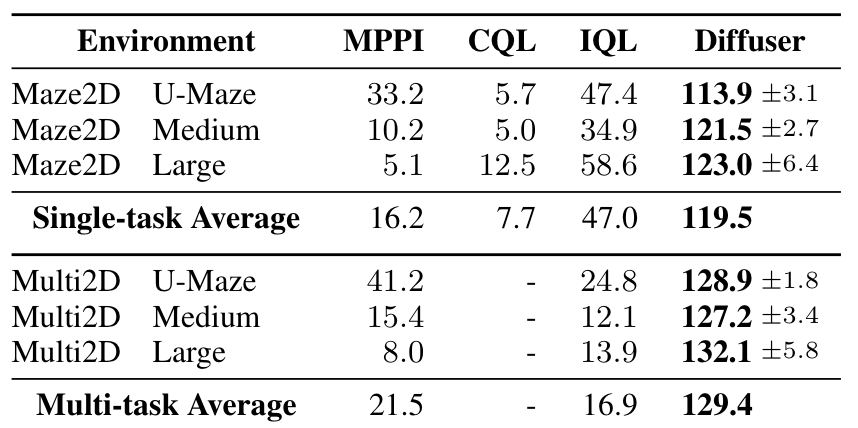
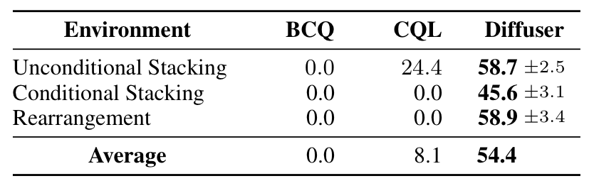
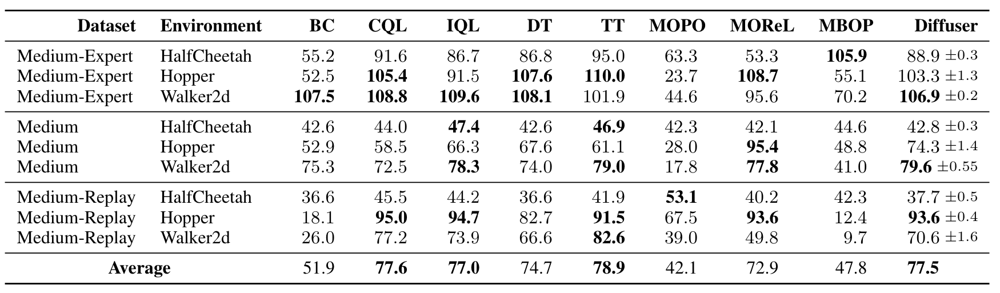

# Planning with Diffusion for Flexible Behavior Synthesis
- Published Date: 20 May 2022
- Category: Diffusion Planner

---

## 📝 Summary of the World Models

This paper proposes Diffuser, a novel framework for trajectory optimization in reinforcement learning that integrates diffusion probabilistic models into the planning process. Traditional model-based RL separates dynamics modeling from planning, which can lead to adversarial trajectories and poor long-horizon performance. Diffuser instead learns a generative model of entire trajectories using a denoising diffusion process. This model allows planning to be treated as sampling with guidance, using classifier gradients or inpainting for goal conditioning. The approach supports long-horizon, sparse-reward planning, multi-task generalization, and flexible test-time behavior synthesis. By tying model learning and planning together, Diffuser significantly outperforms prior offline RL methods on benchmarks like Maze2D, block stacking, and D4RL locomotion, while offering elegant properties like temporal compositionality and variable-length planning horizons.

---

## 💡Key Contribution
- Trajectory-level Diffusion Model:
    - Proposes a trajectory-level denoising diffusion probabilistic model that generates entire state-action sequences concurrently instead of autoregressively.

- Unified Planning and Sampling:
    - Planning is reframed as conditional sampling from the generative model, aligning model learning directly with planning needs

- Flexible Conditioning:
    - Uses classifier-guided sampling where the return function gradient influences trajectory generation.
    - Implements image inpainting-style constraints to satisfy goal-reaching conditions.

- Test-Time Compositionality
    - Able to combine unseen tasks during inference by adding reward gradients
    Supports variable-length plans due to fully convolutional architecture

---

## 💻 Breakdown of the implementation
- Model Type: Denoising Diffusion Probabilistic Model (DDPM)
    - Chosen for its strong generative capabilities and iterative denoising suited for optimization style sampling

- Input Representation
    - 2D matrix of interleaved states and actions, one column per timestep.

- Architecture:
    - **U-Net Style** with 1D Temporal Convolutions
    - Residual blocks with **Group Norm** and **Mish** activaiton
    - Fully convolutional in time to allow variable planning horizons

- Training Objective: Predict the noise added during the forward process:
$$
L(\theta) = \mathbb{E}_{i, \epsilon, \tau^0}[||\epsilon - \epsilon_{\theta}(\tau^i, i)||^2]
$$

- Planning Methods:

    - Classifier-Guided Sampling (for reward-maximization): Incorporates gradients of a learned return predictor $\nabla\mathcal{J}_{\phi}$ during denoising.
    - Inpainting (for constraints): Replaces parts of sampled trajectories to match fixed goal/start conditions

---

## 🧪 Experiments & Result

### Benchmarks:
- Maze2D (Fu et al., 2020): Sparse-reward navigatio tasks
- Multi2D: Multi-task version with randomized goals.
- Block Stacking: Test-time flexible planning (conditional/unconditional/rearrangement).
- D4RL Locomotion: Standard offline RL benchmark with varying data quality. 

### Baselines:
- Model-Free: **CQL**, **IQL**, **BCQ**
- Return-Conditioning: **Decision Transformer (DT)**
- Model-Based: **Trajectory Transformer (TT), MOPO, MORel, MBOP**
- Traditional Planning: **MPPI**

### Results
**Maze2D and Multi2D Performance (Long-Horizon Planning)**:

**Block Stacking Performance (Test-time Flexibility)**:

**Offline RL (D4RL Locomotion)**:

---

## Reference
