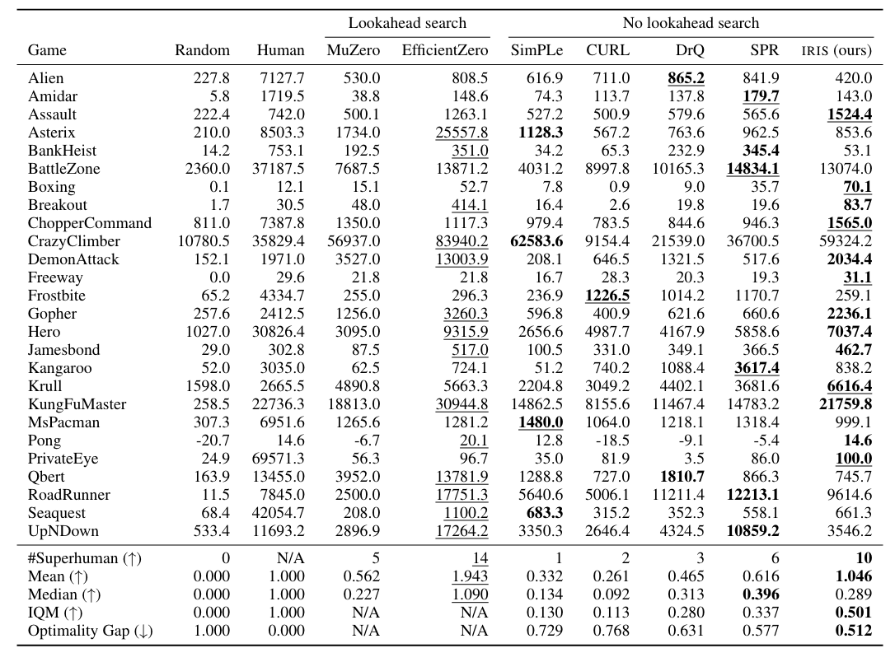

# Transformers Are Sample-Efficient World Models
- Published Date: 1 Sep 2022 
- Category: World Models

---

## 📝 Summary of the World Models
The paper "Transformers are Sample-Efficient World Models" introduces IRIS, a reinforcement learning agent that learns entirely through imagination using a world model composed of a discrete autoencoder and a GPT-like Transformer. The autoencoder compresses high-dimensional visual observations into discrete tokens, and the Transformer models environment dynamics by predicting future tokens, rewards, and episode terminations autoregressively. The policy and value functions are trained using imagined rollouts generated by this model, with no reliance on lookahead search. Evaluated on the Atari 100k benchmark—where agents are limited to only 100k real environment steps—IRIS achieves state-of-the-art performance among methods without lookahead, even surpassing MuZero on several games, and demonstrates strong generalization and efficient learning with minimal hyperparameter tuning.

---

## 💡Key Contribution
- IRIS: A Transformer-based World Model Agent
    - RL agent that learns entirely in the imagination of a world model composed of a discrete autoencoder and a GPT-Style Transformer

- Sample-Efficient Learning Without Lookahead
    - IRIS achieved a SOTA (by the time of publication) on the Atari 100k benchmark without using lookahead search. It only requires ~2 hours of real environment interaction and outperform MuZero[^1] in several games. 

- Token-Based Frame Modeling for Imagination
    - Using a discrete autoencoder to convert images into token sequences. This allows the Transformer to model environment dynamics efficiently.

---

## 💻 Breakdown of the implementation
Coming soon...

---

## 🧪 Experiments & Result

### Benchmarks:
The paper evaluates IRIS on the Atari 100k benchmark, a widely used benchmark for sample-efficient RL.

- Setup: Each agent gets only 100k environment steps per game ($\approx$ 2 hours of real-time gameplay).
- Scope: 26 Atari games

### Baselines:
- **Without Lookahead**: 
    - SimPLe (Kaiser et al., 2020) [^2]
    - CURL (Laskin et al., 2020) [^3]
    - DrQ (Yarats et al., 2021) [^4]
    - SPR (Schwarzer et al., 2021) [^5]
- **With Lookahead**:
    - MuZero (Schrittwieser et al., 2020) [^1]
    - EfficientZero (Ye et al., 2021) [^6]

### Results

---

## Reference
[^1]: Schrittwieser, J. & Antonoglu, I. et al., (2020). *Mastering Atari, Go, chess and shogi by planning with a learned model* Nature, 588(7839): 604-609, 2020.
[^2]: Kaiser, L., Babaeizadeh, M., et al., (2020). *Model-based reinforcement learning for atari*. ICLR 2020.
[^3]: Laskin, M., Srinivas, A., et al., (2020). *CURL: Contrastive Unsupervised Representations for Reinforcement Learning*. ICML 2020.
[^4]: Yarats, D., Kostrikov, I., et al., (2021). *Image Augmentation Is All You Need: Regularizing Deep Reinforcement Learning from Pixels*. ICLR 2021.
[^5]: Schwarzer, M., Anand, A., et al., (2021). *Data-Efficient Reinforcement Learning with Self-Predictive Representations*. ICLR 2021.
[^6]: Ye, W., Liu, S., et al., (2021). *Mastering Atari Games withContrastive Limited Data*. NeurIPS 2021.
